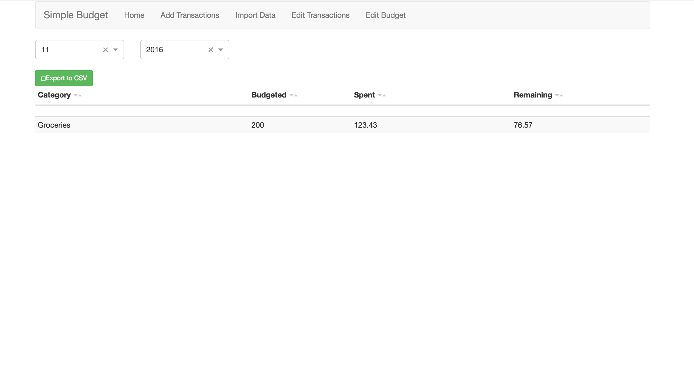

## Budget

A simple budget application

## Getting Started

1. Have docker installed
2. Create new folder called budget (or whatever you want)
3. Within this folder create a folder called "data"
4. In your budget folder run the following from the terminal: docker run -it -p 8080:8080 -v "$PWD/data":/go/src/github.com/tfolkman/budget/data tfolkman/budget
5. Start budgeting: localhost:8080

When done, type CTRL-C to end the process. Your transactions and budgets are stored in a sqlite database at ./data/budget.db.

When you want to budget again, just go back to the directory and follow steps 3 and 4 above.

## Documentation

The main page (seen above) shows for a selected month the amount budgeted, spent, and remaining for each category.

To manually add transaction, go to the "Add Transactions" tab.

To import data (QFX files only supported for now), go to the "Import Data" tab.

To view or edit transactions, go to the "Edit Transactions" tab.

To view, add, or edit a monthly budget, go to the "Edit Budget" tab.

## Road Map

1. Figure out way to sync to Dropbox
2. Add total monthly budget and spend on main page
3. QIF import for paypal
4. Dashboards

